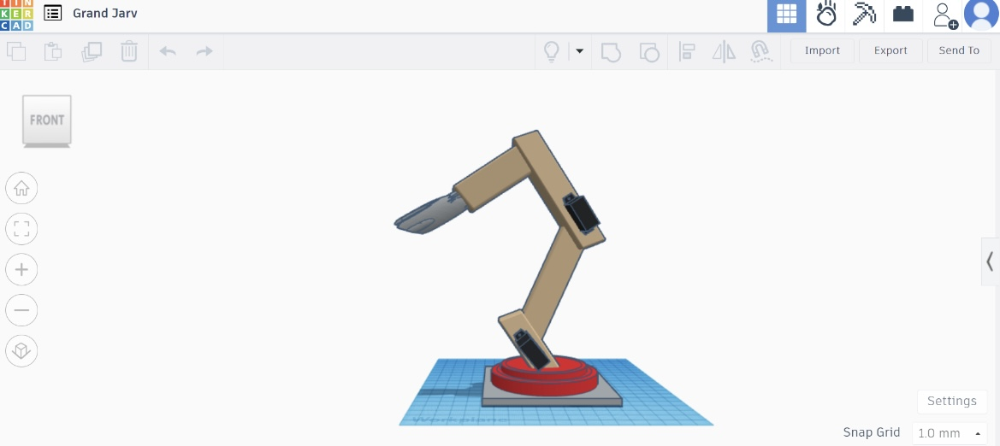
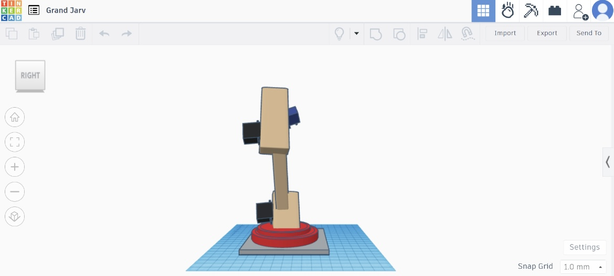
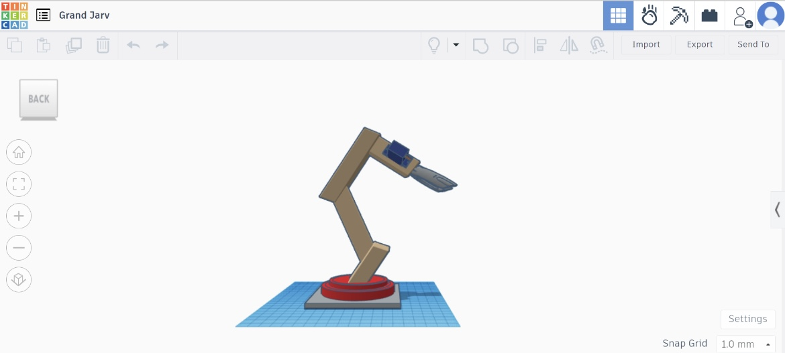
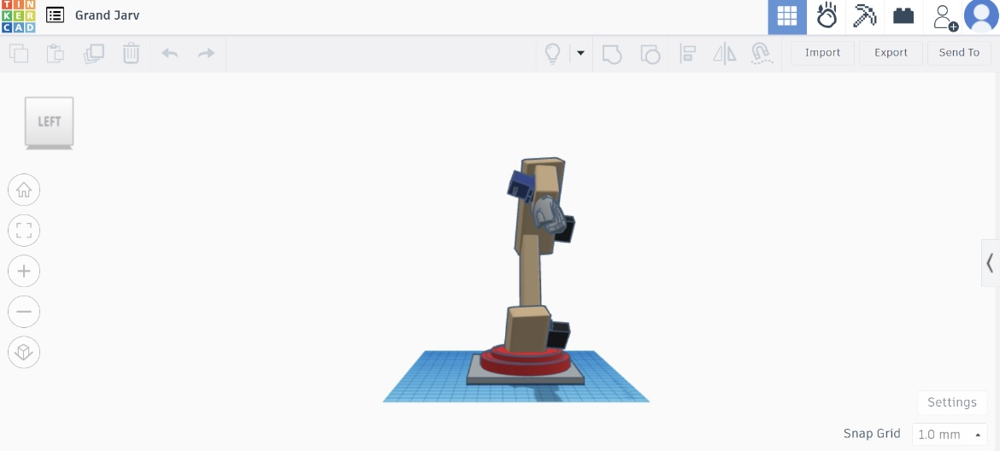
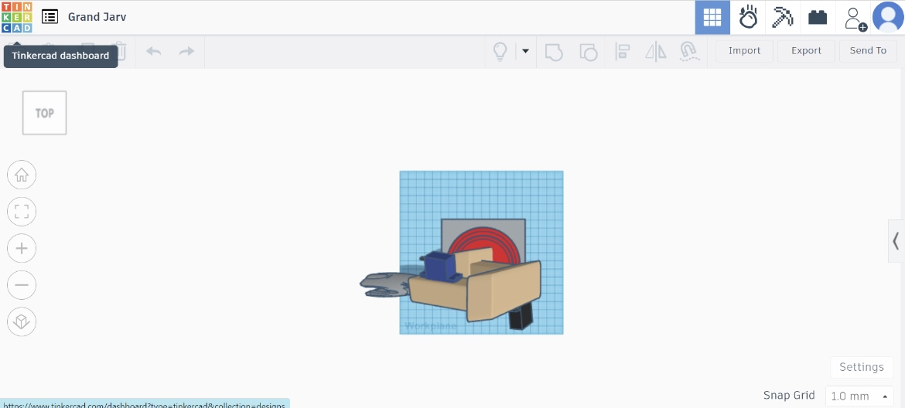

# Three-Dimensional Robotic Arm with 5 Degrees of Freedom

This project involves designing a three-dimensional robotic arm with 5 degrees of freedom using Tinkercad. The arm consists of a base joint, shoulder joint, lower link, upper link, and wrist joint, each controlled by a servo motor.

## Steps to Create the Design

1. **Open Tinkercad**: Start by opening Tinkercad and creating a new 3D design.
2. **Create the Base Joint**: Add the first part of the arm, which is the base joint.
3. **Add the Shoulder Joint**: Create the first shoulder joint and connect it with a servo motor.
4. **Add the Lower Link**: Add the lower link to the shoulder joint.
5. **Add the Upper Link**: Create the upper link and connect it to the shoulder joint with a servo motor.
6. **Create the Wrist Joint**: Add the wrist joint and connect it with a servo motor.
7. **Customize the Arm**: Customize the arm for its intended job and make sure all components are connected properly.

## Design Views

Here are different views of the robotic arm design:

### Front View

### Right View

### Back View

### Left View

### Top View

## 3D Design Link

You can view the 3D design [here](https://www.tinkercad.com/things/2GPhAyvTgFL-grand-jarv/edit?sharecode=3VQWS04c8gVXVozofN4SAiQKK1LJMweBjdRCKp5rgiU).
